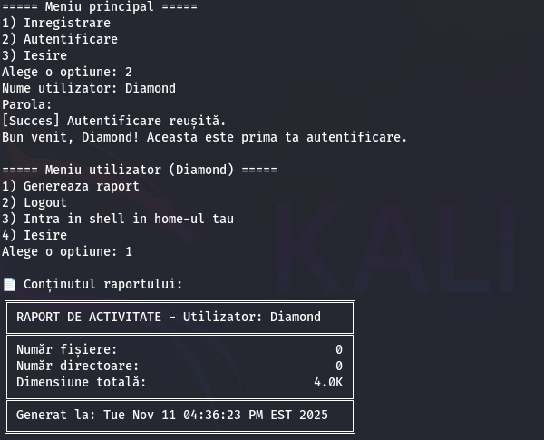
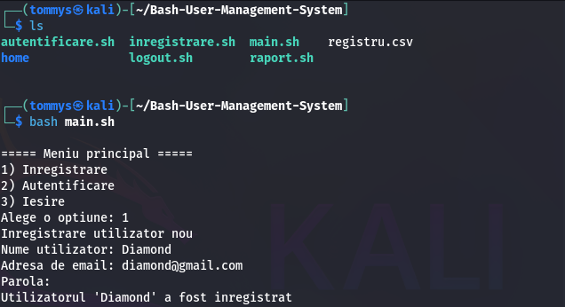

# Bash User Management System

A lightweight user management system built entirely in **Bash** for Linux environments.  
It handles **user registration, authentication, session tracking**, and **CSV-based reporting**, without using any external dependencies.

---

## 🚀 Features

- **User registration** with regex-based validation  
- **Login and logout system** with persistent session file (`.session`)  
- **CSV-based user storage** (`registru.csv`)  
- **Automatic user home directory creation**  
- **Report generation** via shell script (`raport.sh`)  
- **Secure password handling** using hashing  
- Modular design, each feature in a separate `.sh` file  

---

## 🧠 Project structure
```text
├── main.sh             # Entry point
├── autentificare.sh    # User login logic
├── inregistrare.sh     # New user registration
├── logout.sh           # Session cleanup
├── raport.sh           # Report generation
├── registru.csv        # CSV-based user database
├── .session            # Temporary session file
└── home/               # Individual user directories
```
---

## ⚙️ How to run

```bash
chmod +x *.sh
./main.sh
```

- All interactions happen through the terminal interface.
- If this is your first time running it, the script will create a home/ directory for each registered user.

## 🎬 Demo

### 🔐 Login


### 🧾 Registration


## 🧑‍💻 Author

- Project created for the Operating Systems course at CSIE ASE Bucharest.
- Maintained and improved by **iWearFullDiamond**